# 练习提示和技巧

## 1. 理解数据

### 1.1 导入数据并显示数据帧的前5行

聊天提示：在 @workspace /newNotebook 创建一个名为“COVID19 Worldwide Testing Data”的笔记本，导入根目录下的tested_worldwide.csv，并显示前5行数据。

注意：如果出现“找不到pandas库”的错误，请使用Copilot帮助您修复：

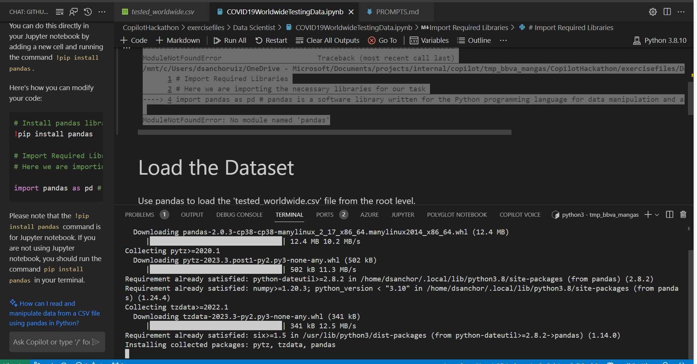

### 1.2 显示数据帧中的行和列数。

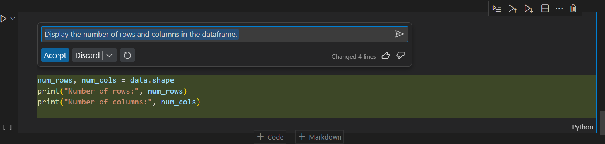

### 1.3 显示每列的数据类型

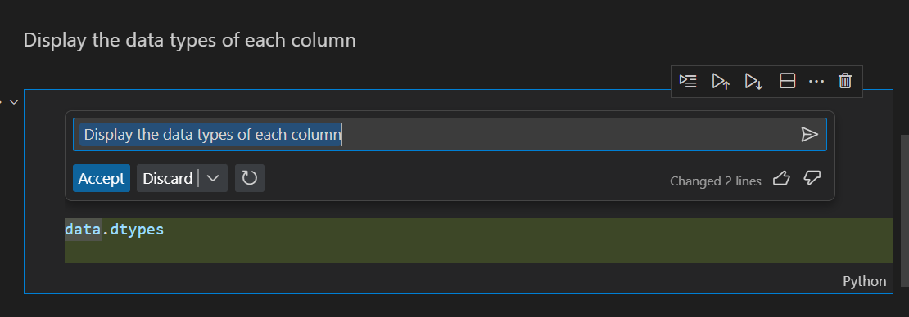

### 1.4 显示每列中的缺失值数量

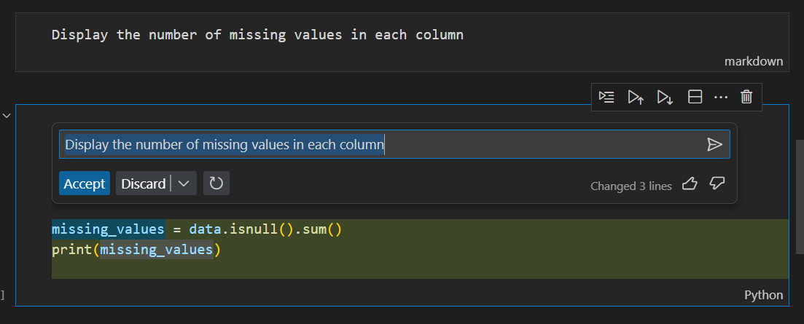

### 1.5 显示每列中的唯一值数量

## 2. 数据清洗

### 2.1 删除分析不需要的列

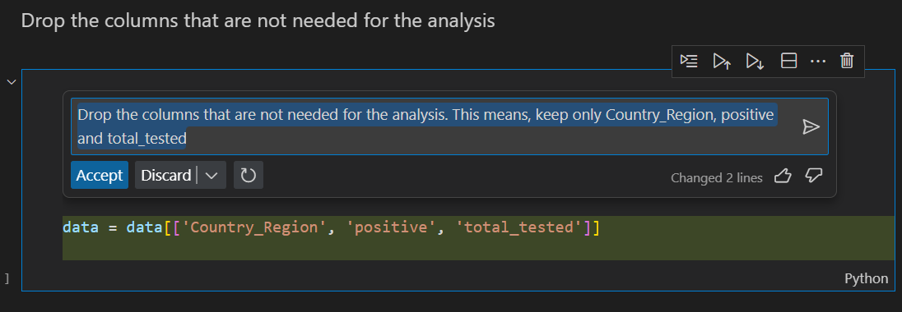

### 2.2 重命名列以使它们更易读

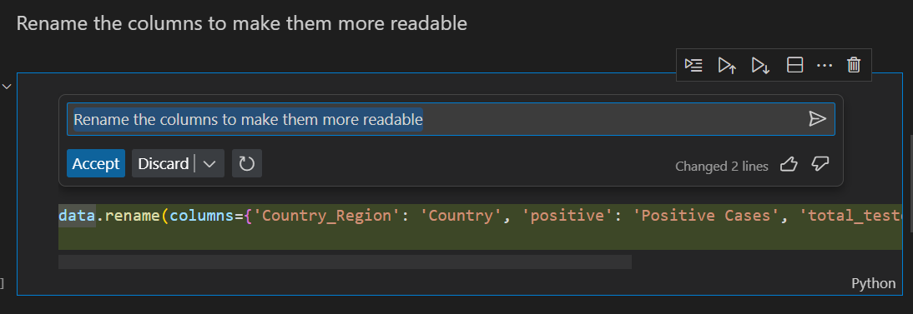

### 2.3 删除具有缺失值的行

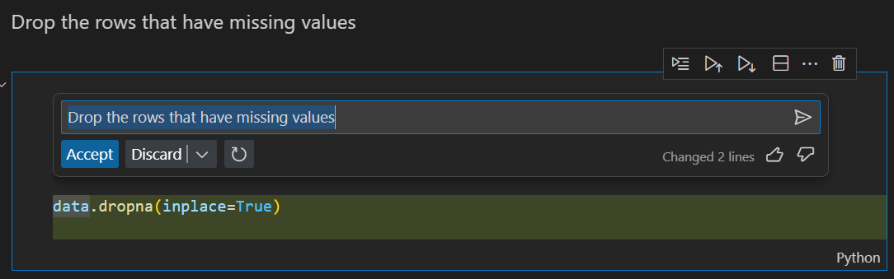

### 2.4 将列的数据类型转换为适当的类型

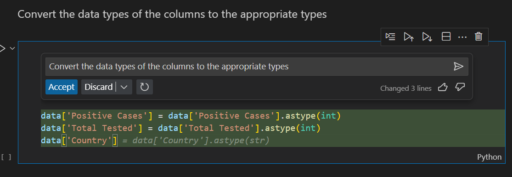

注意：我已经先使用了聊天，然后使用Copilot内联来完成“Country”列的转换。

### 2.5 显示每列中的缺失值数量

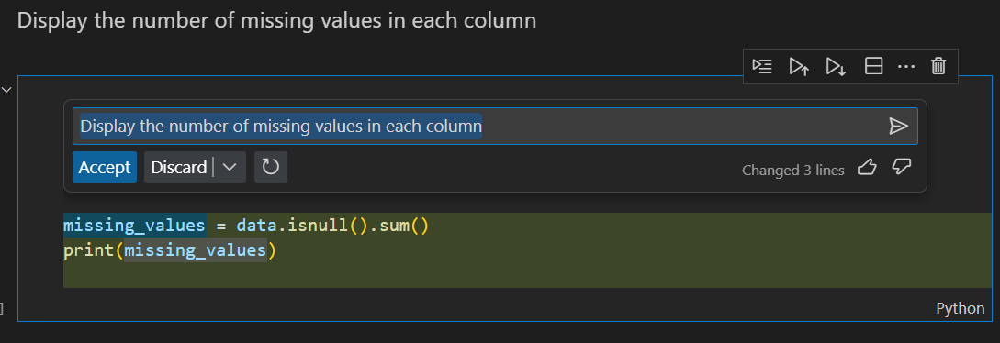

## 3. 提取Covid-19病例最多的前十个国家

### 3.1 创建一个新的数据帧，其中包含每个国家的阳性病例总数。

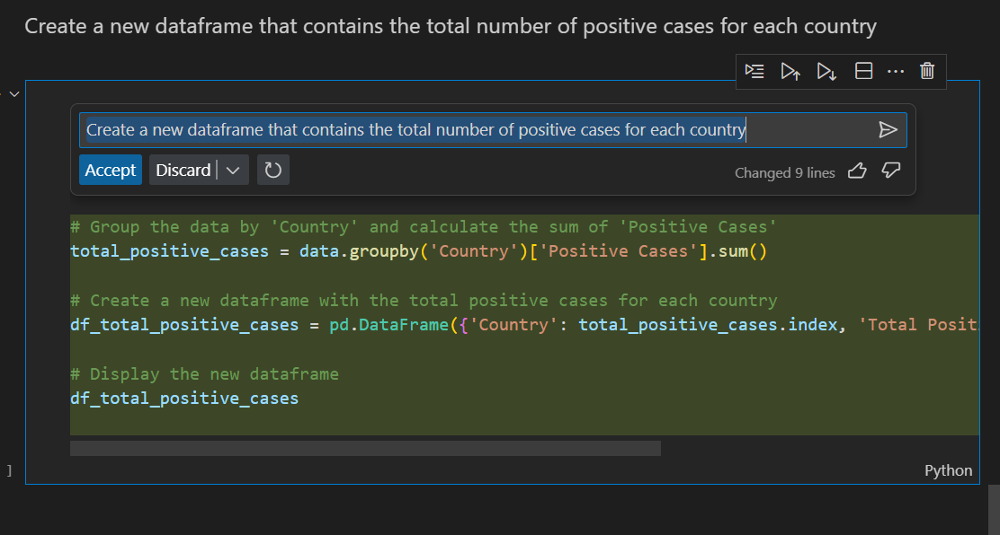

### 3.2 按阳性病例总数降序对数据帧进行排序

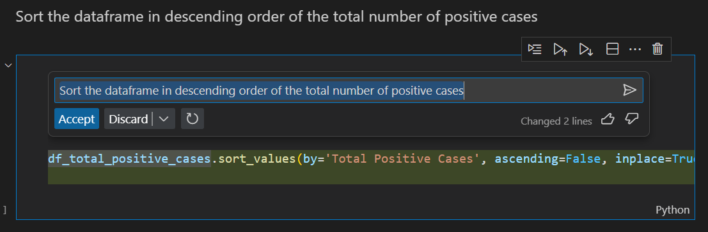

### 3.3 显示阳性病例最多的前十个国家

## 4. 确定阳性病例最多与检测病例最多的比例

### 4.1 创建一个新的数据帧，其中包含每个国家进行的检测病例总数

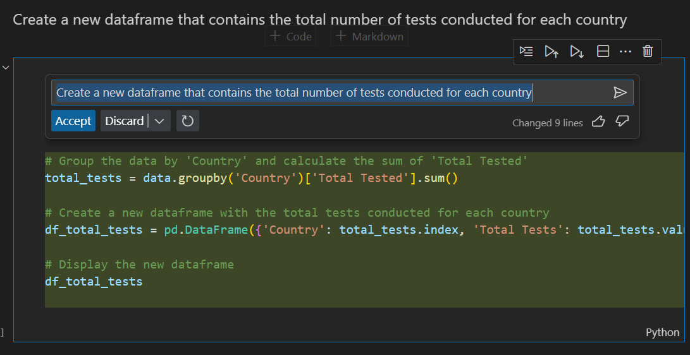

### 4.2 按进行的检测病例总数降序对数据帧进行排序

### 4.3 显示进行了最多检测的前十个国家

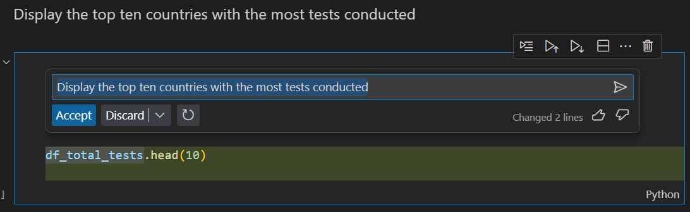

## 5. 确定进行最多检测的顶级三个国家的阳性病例比例

### 5.1 合并前面步骤中创建的两个数据帧

### 5.2 创建一个新列，其中包含阳性病例与进行的检测病例的比例

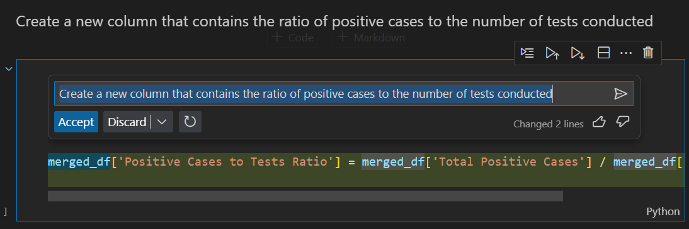

### 5.3 按进行的检测病例与阳性病例比例降序对数据帧进行排序

### 5.4 显示进行最多检测的前三个国家的阳性病例比例

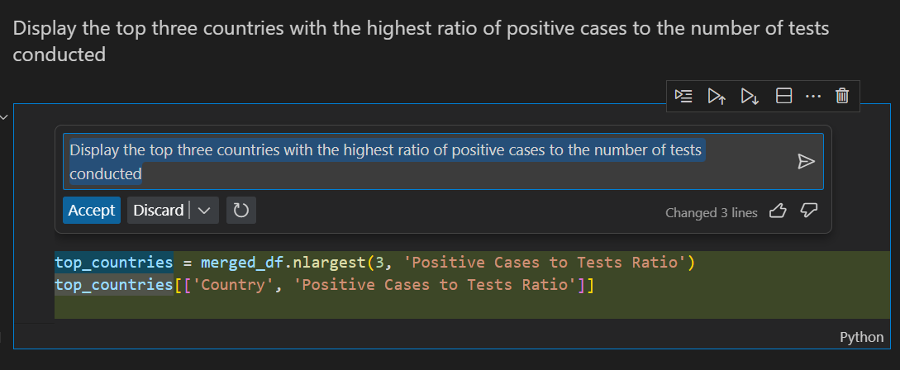

## 6. 显示结果

### 6.1 显示一个图表，显示阳性病例与进行的检测病例比例最高的前三个国家

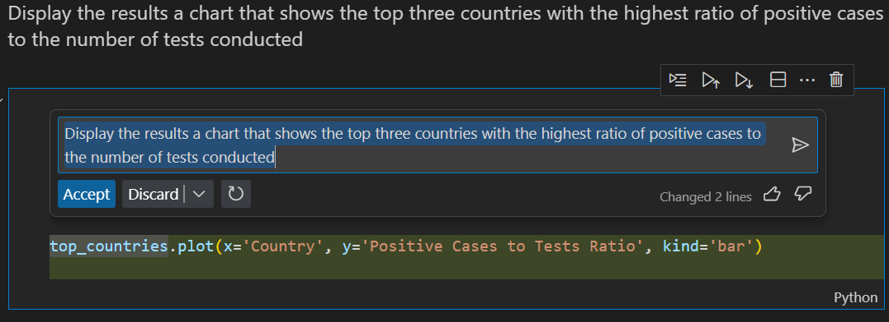

注意：如果出现与“ImportError with matplotlib”相关的错误，请使用Copilot内联来帮助您修复它：

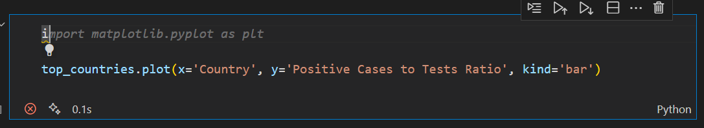

然后，如果找不到模块，使用Copilot聊天来帮助您修复它：

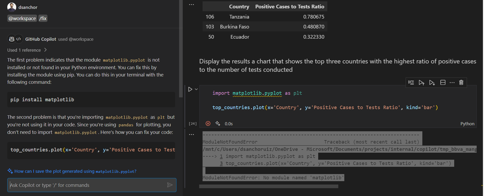

### 6.2 显示一个图表，显示阳性病例最多的前十个国家

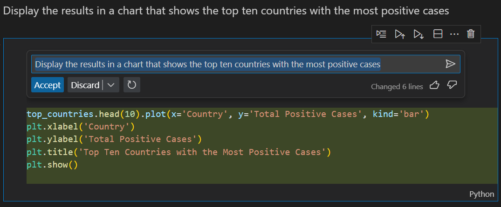

### 6.3 显示一个图表，显示进行的检测病例最多的前十个国家

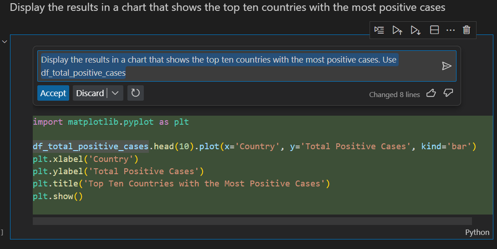